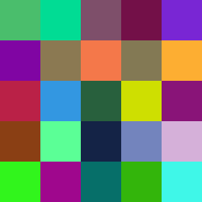

# PNGMaker

Create random png pictures

## Usage

* First parameter: width of output picture
* Second parameter: picure height (must be same than width for now)
* Third parameter: mode
  * 1 - Picture with each pixel is randomized
  * 2 - Large color squares and as greyscale
  * 3 - Large color squares using colors



## Features

* Create random pictures
* Only square pictures currently supported

## Building

```sh
$ cd PNGMaker
$ make pngmaker
$ ./maker.o
```

Clean build environmnt by:

```sh
$ make clean
```
